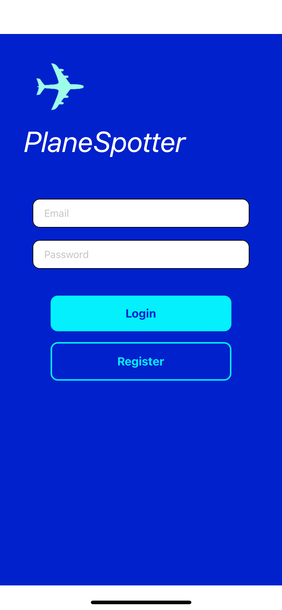
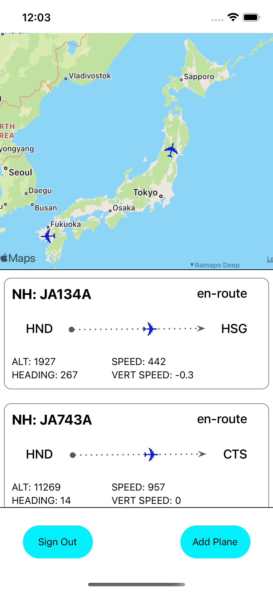

# README.md

# Plane Spotter

**PlaneSpotter** is an app for those who enjoy plane spotting at a hobby. The idea behind this app to track particular aircraft that you would like to get notifications on when it will be inbound at an airport near you.

## **Users Experience**

The premise of this app allows users to track aircraft more easily using an aircrafts tail number (registration number) as opposed to an airlines flight number. Users can create an account in PlaneSpotter, see a list of aircraft they are following with flight details, and also see those aircraft marked on a map.

 

### **Development Restrictions**

At this time **PlaneSpotter** is restricted to aircraft that carry the US or Japan flag. The database is currently fix while in development. As this application moves closer to production, live tracking will be implemented.

## **Frontend**

This repo contains the front end of **PlaneSpotter** which was build with REACT-NATIVE and will soon be deployed on EXPO as development continues

## **Backend**

You can find the backend of **PlaneSpotter** at this GitHub repo [https://github.com/jmcraineydev/plane_spotter](https://github.com/jmcraineydev/plane_spotter)
